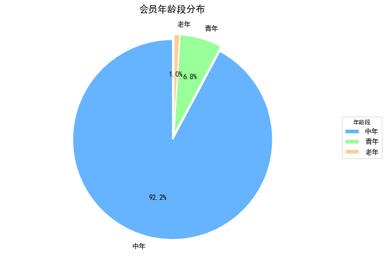
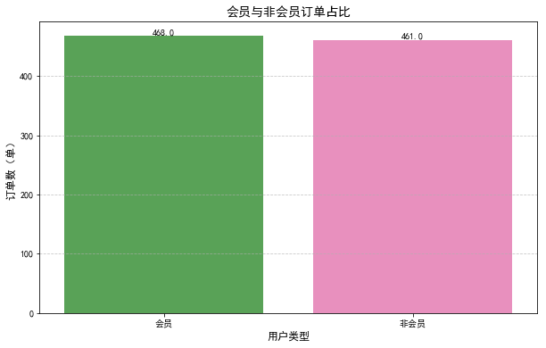
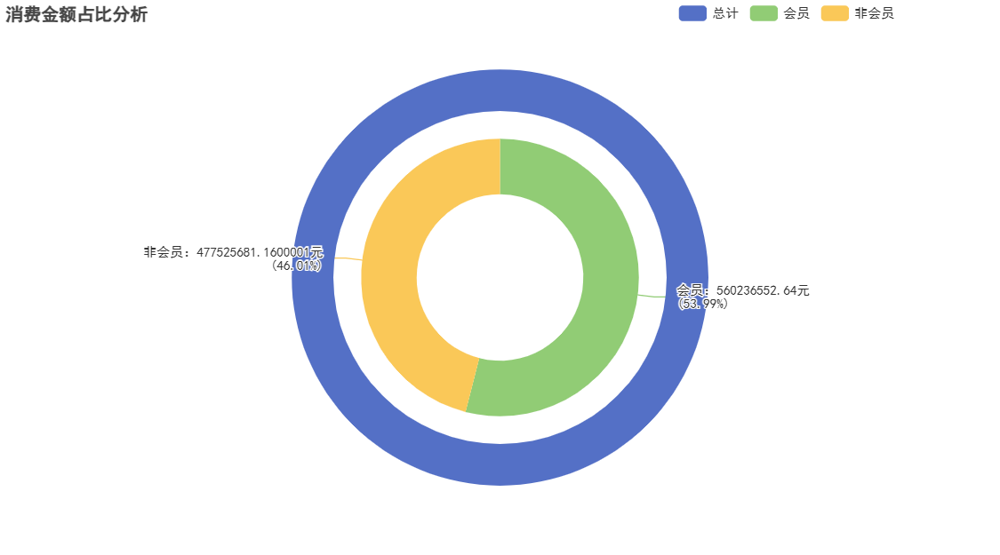

# retail-member-data-analysis
Python 实现商超会员消费全流程数据分析与可视化，包含数据清洗、多表关联、用户画像、时序分析，课程实验项目
# 商超会员消费数据分析
基于 Python + Pandas 完成零售会员数据清洗、多表关联、用户画像与时序可视化分析，课程实验项目。

> 说明：原始实验数据已缺失，本项目仅保留代码、运行结果与可视化图表。

## 🔧 技术栈
NumPy | Pandas | Matplotlib | Seaborn | Pyecharts

## 📊 成果预览
| 性别分布 | 年龄段分布 | 订单对比 | 消费占比 |
| ---- | ---- | ---- |
|  |  |  |  |

## 📋 实验流程
1. 数据读取与缺失值处理
2. 数据去重、异常值过滤
3. 多表关联，区分会员/非会员
4. 人群、时段、季度多维度统计与可视化

## 📈 核心结论
1. 会员以女性、中年群体为主；
2. 会员消费占比 53.28%，是门店核心客源；
3. 周末、晚间为消费高峰，季度消费存在明显波动。

## 🚀 使用
```bash
# 启动笔记
jupyter notebook notebooks/retail_analysis.ipynb
